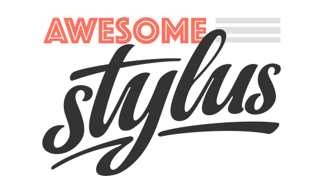

# Awesome Stylus 

> A curated list of Stylus. The main idea is that everyone can contribute here, so we can center all the informations about Stylus and keep up-to-date.

- [Awesome Stylus](#awesome-stylus)
  - [Articles](topics/articles.md)
  - [Boilerplates](topics/boilerplates.md)
  - [Documentations](topics/documentations.md)
  - [Grids](topics/grids.md)
  - [Libraries](topics/libraries.md)
  - [Mixins](topics/mixins.md)  
